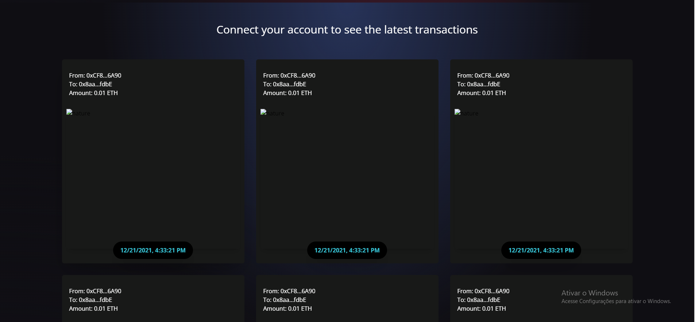

## 💰 Sistema de transações de criptomoedas na blockchain

### Aplicação que permite você se conectar com sua carteira de criptomoedas MetaMask e transferir suas criptomoedas para outra carteira. Essa transação ficará salva na blockchain e será gerado um contrato inteligente da mesma através da rede ethereum. Na aplicação você pode ver as ultimas transações feitas no site

## 🖥️ Algumas Telas Do Projeto

## 💻 Tecnologias Usadas

 

## Instalação 

#### Clone o Projeto Com:  

git clone https://github.com/JoaoRicardo2005/sistema-de-transacoes-blockchain-contratos-inteligentes
#### Entre na pasta e instale as dependências com: 
 Yarn
#### Com tudo correto você pode iniciar o servidor com:
yarn start
#### Se você estiver no ambiente de desenvolvimento, poderá usar o servidor de desenvolvimento:
yarn dev 
yarn queue

